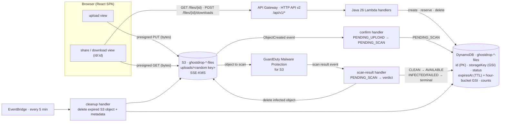
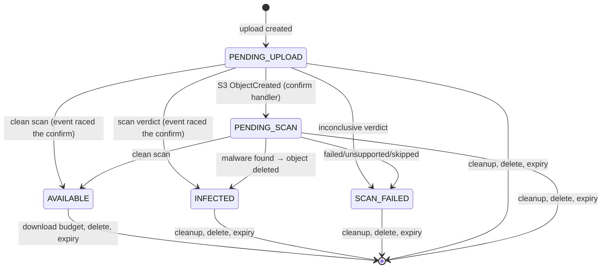

# Architecture

GhostDrop is a temporary-file share: files live in S3 for a bounded time, the
metadata that grants access to them lives in DynamoDB, and Lambda handlers are
the only way to mint short-lived presigned S3 URLs.

## Components



## Backend layers

- `dev.ghostdrop.api` — Lambda `RequestHandler`s. They parse the event, call a
  service, and map failures to stable JSON errors. No AWS business logic here.
- `dev.ghostdrop.application` — `UploadService`, `DownloadService`,
  `DeleteFileService`, `GhostDropSettings`. Orchestrate the domain against the
  `FileRepository`/`StorageService`/`PasswordHasher` ports.
- `dev.ghostdrop.domain` — `TemporaryFile` (immutable), `FileStatus`, and the
  repository/storage/hasher interfaces. No SDK imports.
- `dev.ghostdrop.infrastructure` — DynamoDB and S3 adapters, Argon2 hasher,
  AWS client construction.
- `dev.ghostdrop.configuration` — reads environment into SDK clients.

## Data model

`TemporaryFile` fields map to one DynamoDB row:

| Field | Notes |
| ----- | ----- |
| `id` | random key; public share id |
| `storageKey` | `uploads/<random>`; GSI for event confirmation |
| `status` | lifecycle state machine, below |
| `scannedAt` | when the scan verdict was applied; absent = never scanned |
| `expiresAt` | epoch seconds; TTL + numeric range on hour GSI |
| `expirationBucket` | `yyyy-MM-dd'T'HH` UTC; cleanup scans current + prior hour |
| `downloadCount`, `maxDownloads` | atomic reservation budget |
| `passwordHash` | Argon2id, present only when protected |
| `deletionTokenHash` | SHA-256 of the owner token |

### State machine



Every transition is a conditional DynamoDB `UpdateItem` guarded on the current
`status`, so duplicate events and out-of-order delivery are no-ops: an old
`INFECTED` verdict can never be followed into `AVAILABLE`, and an expired or
deleted row never resurrects. Terminal states are final.

### Atomic download reservation

`reserveDownload(id, now)` runs one conditional `UpdateItem`:

```
SET downloadCount = downloadCount + 1
WHERE status = 'AVAILABLE'
  AND attribute_exists(scannedAt)
  AND expiresAt > :now
  AND (attribute_not_exists(maxDownloads) OR downloadCount < maxDownloads)
```

This is the single point that enforces the scan gate, expiry, and the download
budget. A concurrent attacker cannot overspend because DynamoDB serializes the
condition. Any non-`AVAILABLE` state — or an `AVAILABLE` row that never went
through a scan — is refused here and by `canCreateDownload` before it.

## S3 event confirmation

Files are created `PENDING_UPLOAD` so a share link never resolves before the
bytes exist. S3 emits `ObjectCreated` for `uploads/*`; the confirm handler
finds the row by `storageKey` and moves it to `PENDING_SCAN`. The key is
random, so a spurious event cannot confirm another upload. The object is not
downloadable from this point until a scan verdict arrives.

Confirmation is an async invocation; if the handler keeps failing, Lambda's
retries eventually land the event on an SQS DLQ (`confirm_dlq`) instead of
dropping it silently. An alarm fires when the queue is non-empty; recovery is
operator-driven (fix the cause and re-drive), while the S3 lifecycle rule and
DynamoDB TTL expire any upload that stays in a pre-`AVAILABLE` state
regardless.

## Malware scanning (fail closed)

GuardDuty Malware Protection for S3 is enabled on `uploads/*` in production
(`aws_guardduty_malware_protection_plan` with a dedicated service role). It
scans each new object and publishes exactly one result per object to
EventBridge (`GuardDuty Malware Protection Object Scan Result`); delivery is
at-least-once.

The `ScanResultHandler` Lambda interprets the verdict:

- `scanStatus = COMPLETED` + `NO_THREATS_FOUND` → `PENDING_SCAN → AVAILABLE`
  (and sets `scannedAt`),
- `scanStatus = COMPLETED` + `THREATS_FOUND` → `PENDING_SCAN → INFECTED`, then
  the S3 object is deleted,
- anything else (`FAILED`, `SKIPPED`, `UNSUPPORTED`, `ACCESS_DENIED`, unknown)
  → `PENDING_SCAN → SCAN_FAILED` and stays unavailable.

The system fails closed: **only** an explicitly clean verdict can produce
`AVAILABLE`. Verdicts are never client-supplied; they come from the GuardDuty
service role through EventBridge. Transitions are conditional DynamoDB writes
guarded on `status`, so replayed or out-of-order events are no-ops — an old
`INFECTED` can never be followed by a delayed `CLEAN` into `AVAILABLE`.

Because rows are schemaless, a legacy `AVAILABLE` row created before this
gate existed has no `scannedAt`; `canCreateDownload` and `reserveDownload`
both require `scannedAt`, so legacy rows are treated as not scanned and never
become downloadable. Security takes precedence over compatibility.

Observability: every verdict logs a structured line; metric filters feed
`GhostDrop/ScanInfected` and `GhostDrop/ScanFailures` alarms (production only).

## Cleanup

`findExpired(now)` queries the hour-bucket GSI for the current and previous
hour with `expiresAt <= now`, then deletes each S3 object and row. EventBridge
invokes it every five minutes. It is idempotent: a failed delete is retried on
a later pass. DynamoDB TTL on `expiresAt` is the physical safety net, not the
access-control mechanism (downloads are always refused at reservation time).

Each run logs a structured summary and one line per failed object to stderr
(the Lambda runtime streams it to CloudWatch Logs); a metric filter counts
failures into `GhostDrop/CleanupFailures` and alarms after any failure in 10
minutes. A lifecycle rule additionally expires `uploads/*` after 31 days (the
maximum lifetime is 30), covering rows deleted before their object.

## API protection and observation

The gateway throttles `POST /api/v1/uploads` (10 req/s, burst 20) and, in
production, a WAF rate rule caps each client IP at 500 requests per 5 minutes
— the route throttle is aggregate, the WAF rule is per-IP. Gateway access logs
(JSON: request id, route, status, latency, source IP) stream to CloudWatch
with 7-day retention, and an alarm fires on any 5xx. All four are
production-only resources; the local emulator does not model them.

## Frontend

Two views route on the URL path (no router dependency): `/` is the upload
form; `/d/:id` is the share/download page. Both call `/api/v1/*`. Bytes never
touch the app — upload and download are `fetch` to presigned S3 URLs. Strings
are centralized per locale (`en-US`, `pt-BR`).
